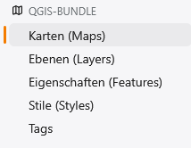
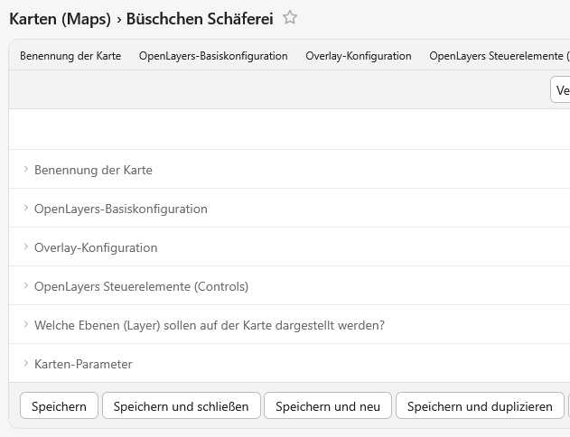
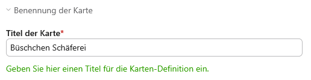
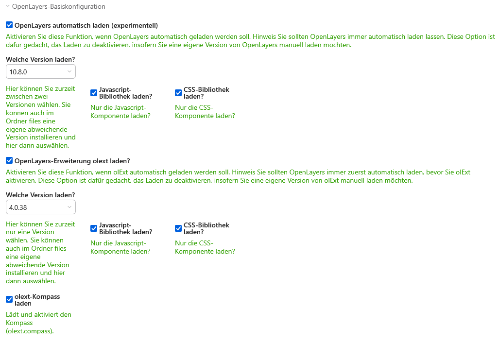
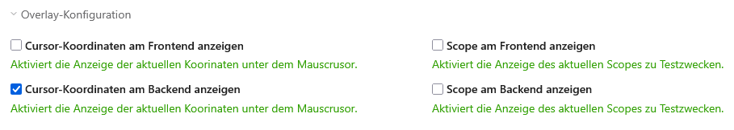
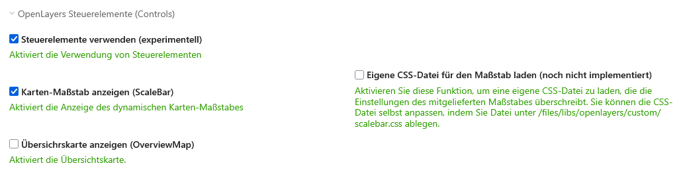
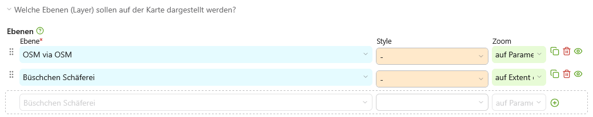
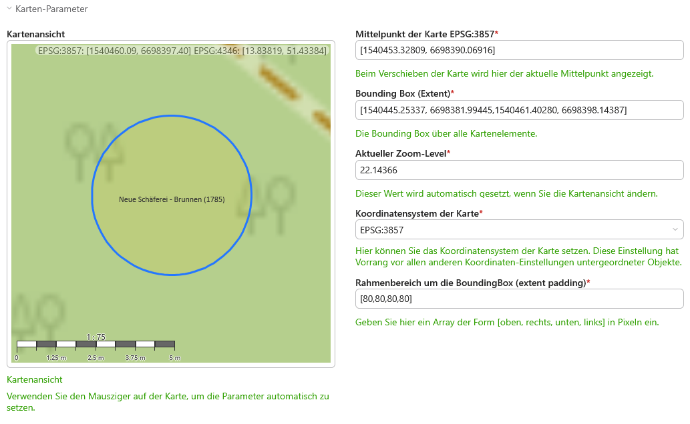
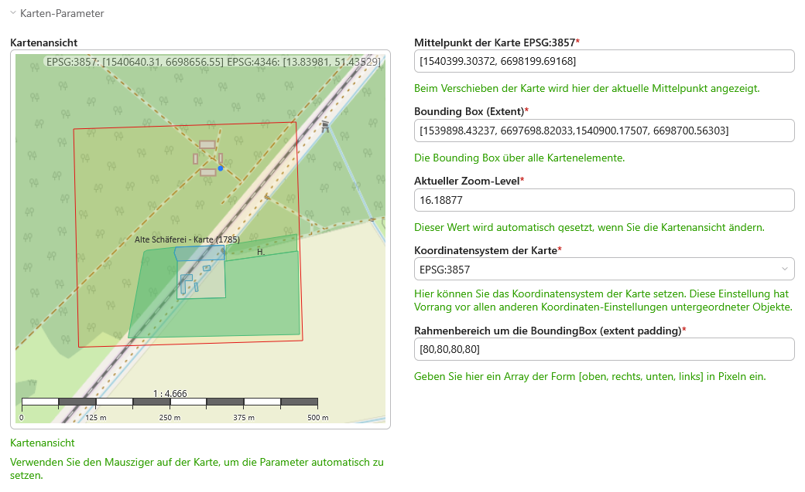
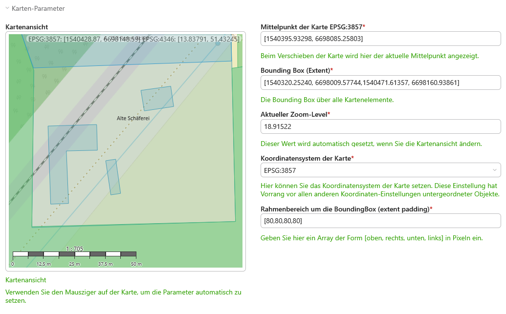

# contao-qgis-bundle
Dieses Bundle ermöglicht die einfache Darstellung von Karten und OpenLayers-Vektor-Objekten im CMS Contao.
Es ist von seinem Ansatz her auf die Weiterverarbeitung von Karten ausgerichtet, die mit dem Programm QGIS erstellt wurden. 

Zurzeit befindet sich das Bundle im experimentellen Stadium. Das Bundle stützt sich auf die Bibliotheken OpenLayers, olExt und [jsts](https://github.com/bjornharrtell/jsts).

## Folgende Funktionen sind implementiert  

1. Karten (BaseMap aus OpenStreetMap)
2. Ebenen (implementiert ol.layers)
3. Eigenschaften (implementiert ol.features) 
4. Stile (implementiert ol.style)
5. augewählte Komponenten aus ol-ext
6. ausgewählte ol.controls
7. ansatzweise Implementierung von georeferenzierten ImageOverlays

> [!CAUTION]
> Das bundle ist experimentell und noch nicht für den produktiven Betrieb geeignet.

Beispieldaten folgen noch ...

### 0. Konzept (Schnelleinstieg - leider alles noch experimentell)
Das grundlegende Ziel des Bundles besteht darin, dem Redakteur / der Redakteurin **ein Werkzeug** an die Hand zu geben, mit
dessen Hilfe sie **in Contao 5+**  eigene **thematische Karten möglichst einfach und schnell erstellen und erweitern können**. Dazu können
vor allem auch Daten im Format GeoJSON verwendet werden. Ideal ist es, wenn die Ersteller über Erfahrungen mit dem
umfangreichen Open-Source-Tool QGIS verfügen. Mit diesem mächtigen Werkzeug kann man in wenigen Schritten umfangreiche und
ansehnliche thematische Karten bauen und georeferenzierte Overlays erzeugen.

Ein weiteres Ziel ist es, **Geoinformationen wiederverwendbar zu erfassen**. Es ist also beispielsweise möglich,
ein bestimmtes Objekt, ein Feld oder ein historisches Bauwerk, auf mehreren Karten und in verschiedenen
Zusammenhängen anzuzeigen. 

Eine typische Vorgehensweise könnte wie folgt aussehen:
1. Sie legen zuerst eine neue **&raquo;Karte&laquo;** an.
2. Sie definieren diese neue **Karte**. Dabei bemerken Sie, dass Sie dafür eine Basis-Karte definieren müssen. 
Jede Karte benötigt ein Base-Layer.
3. Sie definieren also als Nächstes ein Base-Layer, in der Regel als OSM XYZ oder OSM OSM, und registrieren dieses 
Layer auf der Karte. In der Regel sehen Sie danach sofort die Standard-OSM-Karte. 
4. Jetzt möchten Sie Ihre eigenen Karten-Objekte auf der Karte darstellen. Dazu navigieren Sie zuerst mit der
Karte an den Kartenausschnitt, de Sie später am Frontend zeigen möchten und speichern die Karte.   
5. Als Nächstes müssen Sie nun ein VectorLayer anlegen und parametrieren. Wenn Sie Daten auf dem Gebiet von
Deutschland visualisieren wollen, so ist das Bundle bereits darauf voreingestellt. Es parametriert alle Daten
automatisch auf das Koordinatensystem (CRS) **EPSG:3857 - WGS84 - Pseudo-Mercator**. Das ermöglicht eine
unmittelbare Darstellung der Daten in der Karte. Hier ist es aber wichtig, das Koordinatensystem im Contao
und auch in QGIS immer im Blick zu behalten. Sind die Objekte plötzlich nicht mehr sichtbar, so liegt das in
den meisten Fällen an der Wahl des falschen Koordinatensystems! 
6. Wenn Sie ein VectorLayer und parametriert haben, so können Sie eine Datenquelle und ein Quellen-Format wählen. Zurzeit
sind hier jedoch nur Vektor und GeoJSON implementiert. Wählen Sie also diese Quelle und speichern Sie den Datensatz.
7. Jetzt können Sie der Ebene (dem Layer) weitere Geometrie-Objekte (Features) zuordnen. Im Grundzustand haben Sie aber noch
keine erfasst. Sie müssen also als Nächstes die gewünschten Features erfassen.
8. Legen Sie dazu unter Eigenschaften (Features) ein Feature an. Die Seite **Neues Feature** unterstützt die von QGIS exportierte 
GeoJSON Feature-Darstellunmg. Sie können also eine Ebene, die Sie in QGIS vorbereitet haben, per Drag&Drup in die Ansicht ziehen. 
9. Wenn Sie das Feature erstellt haben, so wechseln Sie wieder in die Ebenen-Ansicht und fügen dem Vektor-Layer
dieses Feature hinzu. Achten Sie auf die Sichtbarkeit der Elemente. Das ist noch nicht optimal implementiert. Jedes Element ist
nach dem Erstellen auf unsichtbar gesetzt. Da es eine ganze Kaskade von Elementen gibt, besteht die Gefahr, dass ein Element in
der Hierarchie das Kartenelement am Ende unsichtbar macht. Das wird noch verbessert!
10. Wenn am Backend Ihre Karte mit allen Features wie gewünscht dargestellt wird, so können Sie diese jetzt mit dem
Inhaltselement (Content-Element) "Karte" am Frontend veröffentlichen.
11. Suchen Sie den Artikel, in dem die Karte erscheinen soll, legen sie ein neues Inhaltselement vom Typ "Karte" an. Wählen Sie
die Karten-Quelle. Danach sollte die Karte am Frontend sichtbar sein.
12. Es sind jetzt noch Zusatzeinstellungen möglich. Diese werden weiter unten beschrieben werden.

## Die Funktionen im Einzelnen
Das Bundle-Menü ist wie folgt aufgebaut:  
<kbd></kbd>

Die einzelnen Menüpunkte sind soweit selbsterklärend. Unter dem Menüpunkt **&raquo;Tags&laquo;** können
Sie Stichworte erfassen, mit deren Hilfe Sie nach ausgewählten (getaggten) Objekten filtern können.
Beispielsweise kommen schnell sehr viele Features zusammen, so dass man die Übersicht verliert. 
Sie können nun ein Tag **Flüsse** anlegen und dieses bestimmten Styles oder Features zuweisen. 
So können Sie die Anzeige auf Flüsse einschränken.

### 1. Anlegen einer Karte
Die Edit-Ansicht für eine exemplarische Karte (hier eine nicht mehr existierende Schäferei) enthält
folgende Legenden:

<kbd></kbd>
Geben Sie unter **Titel der Karte** einen aussagefähigen Namen ein.

<kbd></kbd>

Im Abschnitt **OpenLayers-Basiskonfiguration** können Sie zurzeit das Laden der nötigen 
Javascript-Bibliotheken beeinflussen. Ob diese Funktion so bestehen bleibt, ist noch offen. 

Sie können OpenLayers und OlExt gesondert laden. Wenn OlExt geladen ist, so können Sie als exemplarische 
Komponente olext-compass hinzuladen. Sie können Compass durch ein extra Stylesheet gesondert formatieren. 
Diese Funktion wird noch erweitert und gesondert beschrieben.

<kbd></kbd>

Sie sollten OpenLayers immer automatisch laden. Es sei denn, Sie möchten mit dem Bundle experimentieren. 
Dann können Sie hier das Laden von ol.js und ol.css unterbinden. Danach müssen Sie aber im betreffenden 
Artikel, indem Sie die Karte platzieren möchten, die nötigen Bibliotheken selbst laden.

Im Abschnitt **Overlay-Konfiguration** können Sie "benutzerdefinierte Karten-Overlays" konfigurieren. Hier 
sollen später weitere Overlays hinzukommen. Implementiert sind zurzeit folgende Overlays:

<kbd></kbd>

Sie können die Anzeige von Cursor-Koordinaten am Frontend und am Backend gesondert aktivieren. Weiterhin
können Sie zu Testzwecken den Scope (frontend|backend) im Widget mit anzeigen lassen. Diese Fuktion ist nur
zum Debugging gedacht und wird wohl später entfernt werden.

Im Abschnitt **OpenLayers Steuerelemente (Controls)** können Sie die von OpenLayers "mitgelieferten" 
Steuerelemente konfigurieren. Standardmäßig sind die Steuerelemente deaktiviert. 

Hier sind exemplarisch zwei Steuerelemente implementiert. Weitere können folgen.

<kbd></kbd>

Sie können einen Maßstab anzeigen lassen (ScaleBar-Control) und die Übersichtskarte (OverviewMap-Control) 
einblenden. Zurzeit werden diese beiden Steuerelemente mit ihren internen Formatierungen (Styling) dargestellt. 
Es ist bereits vorbereitet, dass Sie später eigene und steuerelement-bezogene CSS-Dateien hinzuladen können, um 
die Steuerelemente individuell zu stylen.

In der nächsten Legende **Ebenen (Layer)** können Sie nun endlich vordefinierte Ebenen auswählen, die auf der 
Karte dargestellt werden. Dazu gehört standardmäßig eine Basis-Ebene (Base-Layer), meist OSM, und eine eigene
benutzerdefinierte Ebene. Zur Verwaltung dieser Daten wird hier der neue RowWizard verwendet. Das ermöglicht 
den Redakteurinnen und Redakteuren, die einzelnen Layer in ihrer Reihenfolge zu ordnen.

<kbd></kbd>

Die Layer werden also in ihrer Reihenfolge von oben nach unten **gerendert**. Das ermöflicht es, bestimmte 
Ebenen oder Themen hervorzuheben.

Hier gibt es ein paar implementierte Besonderheiten, die den Redakteuren die Arbeit etwas erleichtern sollen. 
Zum einen kann man dem gesamten Layer hier einen Style zuweisen (der Style muss vorher definiert 
worden sein, siehe weiter unten). Zum anderen kann man hier ein ebenen-spezifisches Zoom-Verhalten definieren.
Für das Zoom-Handling sind zurzeit drei Modi implementiert (weitere sind denkbar):

1. Zoom auf **Parameter**
2. Zoom auf **Umfang der Ebene** (extent of layer) und
3. Zoom auf **Umfang einer untergeordneten Eigenschaft** (extent of feature)

Diese Modi verhalten sich wie folgt:

1. **Zoom auf Parameter:** Wenn die Karte am Frontend gerendert wird, so werden dazu nur die Parameter herangezogen,
die unter **Karten-Parameter** angegeben (errechnet, macht das Widget teilweise selbst) wurden.
Das eröffnet die Möglichkeit, die Karte am Frontend so darzustellen, dass der visuelle
Schwerpunkt auf einem speziell ausgewählten und untypischen Element liegt. Beispielsweise 
einem Baum, einer Wegekreuzung oder einem namenlosen Felsen etc.

_Dieser Modus hat folgende Wirkung. Das Beispiel aus der Kontrollansicht am Backend zeigt den Brunnen
der nörlichen &raquo;neuen Schäferei&laquo; als ein untypisches Element, auf das die Karte zentriert
werden soll. Hier werden alle Parameter neben der Karte zur Darstellung herangezogen._ 

<kbd></kbd>

2. **Zoom auf Umfang der Ebene (extent of layer)**: Bei dieser Darstellungsweise, wird vor der Visualisierung der Karte 
am Frontend zuerst der Umfang (Extent) aller determinierten Vektor-Komponenten berechnet. (dazu wurde die 
Extent-Funktion aus OpenLayers nach Contao portiert). Der View wird dann so parametriert, dass der Extent genau 
mitting auf der Karte zu liegen kommt. Dazu wird noch der Rand des Umfanges (besser extent padding) hinzu addiert. 
Erst wenn diese Daten vorliegen, wird die Karte gerendert.  

_Dieser Modus hat folgende Wirkung: Das Widget berechnet den Extent + Padding und rendert danach die Karte. Dieser 
Modus gewährleistet eine optimale Darstellung aller Kartenelemente. Im Beispiel unten werden alle Vektor-Daten, die zur 
Schäferei erfasst sind, mittig auf der Karte platziert._

<kbd></kbd>

3. **Zoom auf Umfang einer untergeordneten Eigenschaft (extent of feature)**: Diesen Modus ist etwas komplizierter 
und es gibt ihn in dieser Weise in OpenLayers nicht. Er ermöglicht es, die Karte in der Ansicht (View) so zu
parametrieren, dass nur ein speziell ausgewähltes Objekt oder eine "thematische Gruppe" (meinetwegen ein Haus
an einem See), als wesentliches Objekt dargestellt wird. Dabei wird nur der Extent + Padding dieses einen
Objekts (bei mehreren Objekten, dieser Gruppe) berechnet und an den View übergeben.

> [!CAUTION]
> Dieser Modus hat Vorrang vor allen anderen Modi. Wird auf den Extent eines Features gezoomt, so werden alle
> übergeordneten Zoom-Einstellungen unwirksam. Es wird Zoom auf dieses Feture immer durchgesetzt!

> [!CAUTION]
> Beachten Sie auch! Wenn Sie diese Funktion verwenden möchten, so müssen Sie auf der zugrunde liegenden Ebene
> (Layer), die dort ebenfalls vorhandene Eigenschaft **Zoom** auf den Modus **kombinieren** setzen. Siehe näheres 
> dazu unter **Ebenen**.

_Dieser Modus hat folgende Wirkung: Das Widget durchläuft alle Features aller Layer und ermittelt dabei, bei 
welchem Feature diese Eigenschaft "kombinieren" aktiviert ist. Findet es eine Eigenschaft mit dem Modus
"kombinieren", so berechnet es den Extent dieses Features und speichert ihn zwischen. Findet es eine
weitere Eigenschaft mit dem Modus "kombinieren", so erweitert es den zuvor gefundenen Extent um den
Extent dieses Feature. Auf diese Weise lassen sich Gruppen von Objekten bilden, auf deren Extent der
View rendert. Dieser Modus gewährleistet eine optimale Darstellung heterogener Kartenelemente, 
wie beispielsweise einem See und dem nahe gelegenen Haus. Beide Elemente werden optimal im View
positioniert. (diese Funktion ist noch experimentell!)_

_Im Beispiel wurden alle Elmente des Innanhofes der &raquo;Alten Schäferei&laquo; aus dem Vektor-Layer ausgewählt.
Alle anderen Elemente bleiben im View sekundär. Nur der Innenhof wird zentriert und mit Padding dargestellt._

<kbd></kbd>

